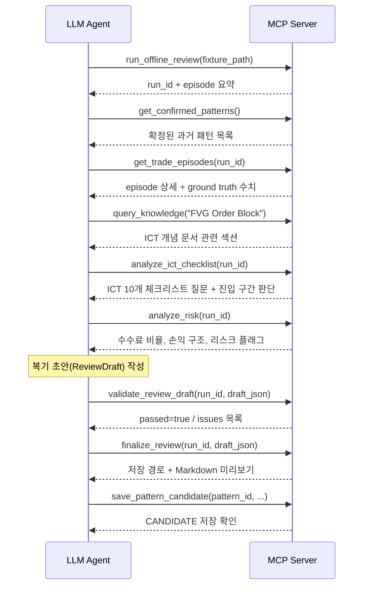

# Trade Review Agent

거래 체결 원본을 읽어 Python 계산 결과를 ground truth로 삼는 **읽기 전용 거래 복기 파이프라인 프로토타입**입니다.

---

## 해결하려 한 문제

매매 후 복기 과정에서 두 가지 문제가 반복됩니다.

1. LLM이 생성하는 복기 초안에 계산 근거가 명시되지 않아 틀린 수치를 발견하기 어렵다.
2. 심리적 추측성 서술("탐욕적이었다", "FOMO였다")이 검증 불가능한 형태로 기록된다.

이 프로젝트는 Python으로 직접 계산한 손익·수수료를 evidence로 만들고, LLM 출력이 그 evidence를 명시적으로 참조하는지 Python 코드로 검증하는 구조를 실험합니다.

---

## 핵심 설계 원칙

- **읽기 전용**: 주문 실행·자동매매·포지션 변경을 하지 않습니다.
- **Python 계산 우선**: 거래소 제공 realized PnL은 참고값이며, Python VWAP 기반 계산을 ground truth로 사용합니다.
- **Evidence 참조 강제**: 복기 초안의 수치는 반드시 evidence ID로 추적 가능해야 합니다.
- **Human-in-the-loop**: 패턴 메모리에 기록되려면 사용자 확인이 필요합니다.
- **미래 데이터 차단**: 시점 기준 캔들 분리(`split_candles_asof`)로 look-ahead를 방지합니다.

---

## 파이프라인 구조


---

## MCP Agent 흐름

`src/ict_review/mcp_server.py`는 파이프라인 전체를 **MCP 도구**로 노출합니다.
Claude Desktop, Hermes 등 MCP 호환 에이전트가 다음 순서로 도구를 호출합니다.



### MCP 서버 연결 방법

```bash
# Claude Desktop: claude_desktop_config.example.json 참고
# 예시 (프로젝트 루트에서)
python -m ict_review.mcp_server
```

`claude_desktop_config.example.json`을 `~/Library/Application Support/Claude/claude_desktop_config.json` (Mac) 또는 `%APPDATA%\Claude\claude_desktop_config.json` (Windows)에 복사 후 경로를 수정하세요.

---

## 주요 기능

| 모듈 | 역할 |
|---|---|
| `mcp_server` | 파이프라인 전체를 MCP 도구 9개로 노출 (Agent loop 진입점) |
| `mcp_server.query_knowledge` | ICT 개념 문서 검색 (FVG, OB, MSS 등) |
| `mcp_server.analyze_ict_checklist` | ICT 10개 체크리스트 항목 + Premium/Discount 구간 판단 |
| `mcp_server.analyze_risk` | 수수료 비율, 손익 구조, 리스크 플래그 계산 |
| `llm/llm_client` | LiteLLM 프록시 경유 ReviewDraft 생성 (HTTP 429 재시도 포함) |
| `ledger/normalize_fills` | 거래소 응답을 내부 `Fill` 모델로 정규화 |
| `ledger/episode_builder` | 체결을 포지션 에피소드로 복원하고 gross/net PnL 계산 |
| `ledger/position_engine` | 체결 유효성 검증 및 포지션 전환 감지 |
| `features/asof` | 진입 시점 기준으로 캔들을 분리해 look-ahead 방지 |
| `validation/evidence_validator` | LLM 출력 구조와 evidence 참조 정합성 검증 |
| `narrative/pattern_memory` | CANDIDATE → CONFIRMED 패턴 메모리 관리 |
| `rendering/markdown_renderer` | 검증된 복기 초안을 Markdown으로 렌더링 |
| `ingestion/manifest` | 실행 단위별 입출력 파일과 SHA-256 체크섬 추적 |
| `cli/review_offline` | 전체 오프라인 파이프라인 CLI 진입점 |

---

## Synthetic 오프라인 데모 실행

> **이 예제는 가상 데이터(synthetic)입니다. 실제 거래 성과와 무관합니다.**

```bash
python -m venv .venv
source .venv/bin/activate          # Windows: .\.venv\Scripts\Activate.ps1
pip install -r requirements.txt
export PYTHONPATH=src              # Windows: $env:PYTHONPATH = "src"

python -m ict_review.cli.review_offline \
  --fixture examples/synthetic_input.json \
  --data-root .pytest-tmp/example-data \
  --run-id run_20260115T090000Z_abcdef123456
```

실행 결과는 `.pytest-tmp/example-data/runs/run_20260115T090000Z_abcdef123456/` 디렉터리에 생성됩니다.

생성 파일:
- `manifest.json` — 실행 단계별 상태와 파일 체크섬
- `normalized_fills.json` — 정규화된 체결 목록
- `episodes.json` — 포지션 에피소드와 PnL
- `features.json` — 시점 기준 캔들 분리 결과
- `review_draft.json` — 구조화된 복기 초안
- `review.md` — 렌더링된 Markdown 복기
- `evidence.json` — evidence 참조 목록

---

## 예시 입력과 출력

### 입력: [`examples/synthetic_input.json`](examples/synthetic_input.json)

가상 BTCUSDT 체결 2건 + 5분봉 캔들 3개.

```json
{
  "fills": [
    {"fill_id": "synthetic-fill-1", "side": "BUY",  "quantity": "1", "price": "100", "fee": "1", "filled_at": "2026-01-15T09:00:00+00:00"},
    {"fill_id": "synthetic-fill-2", "side": "SELL", "quantity": "1", "price": "110", "fee": "1", "filled_at": "2026-01-15T09:05:00+00:00"}
  ],
  "event_time": "2026-01-15T09:00:00+00:00",
  "candles": [...]
}
```

### 출력: [`examples/synthetic_review.md`](examples/synthetic_review.md)

```
## Metrics
| Metric              | Value                  | Evidence |
|---------------------|------------------------|----------|
| calculated_net_pnl  | 8.000000000000000000   | ev-pnl   |
| fees                | 2                      | ev-fee   |
| gross_realized_pnl  | 10.000000000000000000  | ev-pnl   |
```

계산 근거:
- gross PnL: (110 − 100) × 1 = **10 USDT**
- net PnL: 10 − 2(수수료) = **8 USDT**
- 각 수치는 `ev-pnl`, `ev-fee` evidence ID로 추적 가능

구조화된 출력 전체: [`examples/synthetic_review.json`](examples/synthetic_review.json)

---

## 테스트

```bash
pytest -q
```

`pytest>=8.0`, `tzdata` 외 추가 의존성 없음. API 키 불필요.

**테스트 결과 (Python 3.10+ 기준):**

| 구분 | 수 |
|---|---|
| 통과 | 80개 |
| 건너뜀 | 4개 (PowerShell 미설치 환경) |
| 실패 | 0개 |

`tests/test_daily_agent_scripts.py`의 4개 테스트는 Windows PowerShell이 설치된 환경에서만 실행되며, Linux/macOS에서는 자동으로 건너뜁니다.

---

## 개인정보 및 비밀정보 처리

**실제 거래 원본, 주문 정보, 손익 기록, API 인증정보는 이 저장소에 포함되지 않습니다.**

- `.env.example`: 필요한 환경변수 목록만 제공. 실제 값은 로컬 `.env`에만 설정.
- `examples/`: 가상(synthetic) 데이터만 포함. 실제 계좌 데이터 아님.
- `.gitignore`: `.env`, `data/`, `*.log` 등 민감 파일 제외.

실제 API 자격 증명은 커밋하지 말고 `.env.example`을 복사한 로컬 `.env`에만 설정하십시오.

---

## 현재 한계

- 예제 데이터는 가상 데이터이며 실제 운용 성과를 나타내지 않습니다.
- 이 프로젝트는 주문 실행, 자동매매, 수익 개선을 제공하지 않습니다.
- 외부 LLM/Hermes 연동은 별도 로컬 설정이 필요하며 재현 테스트는 오프라인 경로를 기준으로 합니다.
- 단방향(one-way) 포지션 모드만 지원합니다. 헤지 모드·교차 증거금은 미지원입니다.
- 거래소 응답 형식이 바뀌면 어댑터 수정이 필요할 수 있습니다.
- `schemas/` 폴더의 JSON Schema는 출력 형식 문서화 참고 자료이며, 현재 실행 시 직접 사용되지 않습니다.
- PowerShell 스크립트(`scripts/`)는 Windows 환경 전용이며, Linux/macOS에서는 별도 대응이 필요합니다.

---

## 향후 개선 방향

- 헤지 모드 및 복합 심볼 지원 검토
- evidence validator의 JSON Schema 기반 강화
- 패턴 메모리 확인 UI 프로토타입
- 다중 거래소 어댑터 추가
- MCP 도구 단위 테스트 추가

---

## 실행 요구사항

- Python 3.10 이상
- `pip install -r requirements.txt`
